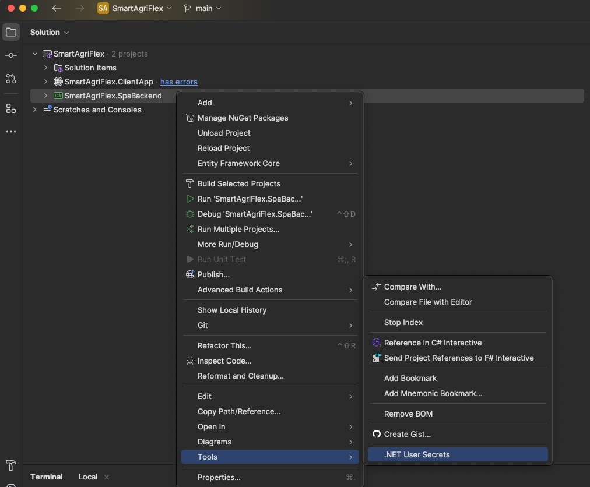
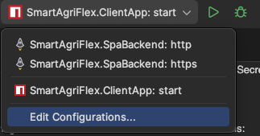
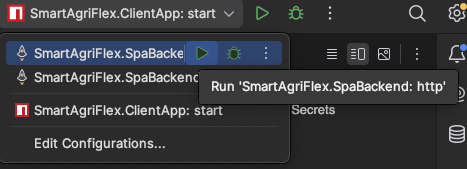
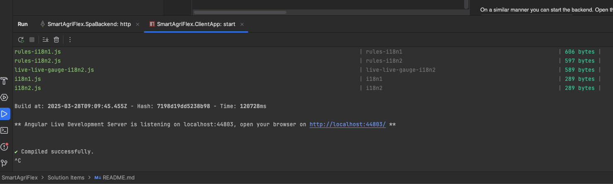

> # ***SmartAgriFlex***

---

## What this project is about

---

Smart AgriFlex is a platform that was design to simplify the use of advance techniques such as Machine Learning(ML) and Data Analytics (DA). This is achieved through a user-friendly User Interface (UI) making complesx processes easily accessible 

### Some of the Objectives:

---

- Provide an easy-to-use platform with user-friendly UI
- Integrate Data ingestion of different kinds of components including sensor Devices and Weather Stations
- Implement a real time monitoring component for the measurements provided by the heterogeneous sensor devices 
- Implement a component for historical data visualisations with filtering options that can be used for predictive analytics 
- Provide a data management for the environmental measurements

---

# Prerequisites 


To set up the SmartAgriflex you need to have one IDE of your choice.
(I am using Rider for the examples below). To take advantage of the full capabilities of the project make sure that you have python installed to run the python script for simulating live data injestion


# The Set Up

- After cloning the project locally open the .sln file in your preferred IDE
- Open a new terminal and navigate under the `/directory/of/the/project/SmartAgriFlex.ClientApp` and install the dependencies using the following command

npm install 

```bash
cd directory/of/the/project/SmartAgriFlex.ClientApp

# Install npm dependencies
npm install

# you may need sudo if you are using a mac
sudo npm install
```

- In Rider under solution explorer: in SmartAgriFlex.SpaBackend, right click, tools -> .NET user Secrets



In this file we need to specify the connection string for teh database. The final file should be like this:


```bash
{ 
 "ConnectionStrings:DefaultConnection": "User Id=inspirecenter_sensors;Password=9Rhf43m3@;Server=p3nwplsk12sql-v17.shr.prod.phx3.secureserver.net;Database=inspirecenter_sensors;Encrypt=False;TrustServerCertificate=True;"
}
```

# Rider

Make sure that the run/debug widget `top/right` (assuming default UI layout)
is populated with 3 options:

* `SmartAgriFlex.SpaBackend: http`
* `SmartAgriFlex.SpaBackend: https`
* `SmartAgriFlex.ClientApp: start`



### Running the project

Open the run/debug widget dropdown, click **run** for the client app `SmartAgriFlex.ClientApp: start`. It will be running on its own in the
background.

On a similar manner you can start the backend. Open the run/debug widget dropdown, click **run** for the backend app `SmartAgriFlex.SpBackend: http`. It will be running on its own in the
background. Make sure that you run `http` AND NOT https to work properly.



Once both processes are running, open the URL that's printed in the **ClientApp's output**.




***

>  # ***Additional Scripts***


## Run the python script for ingest data
